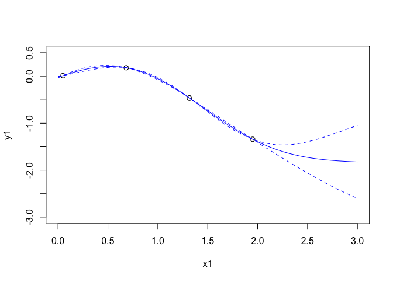
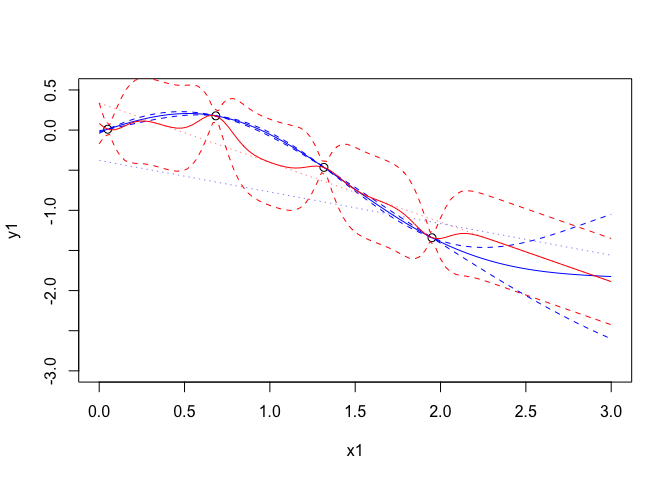
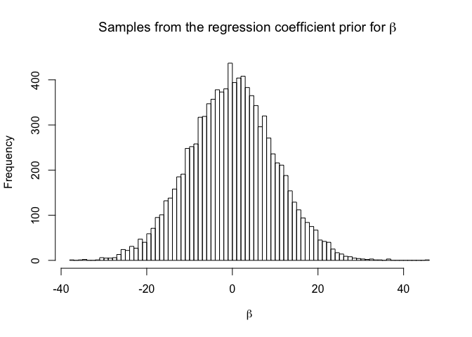
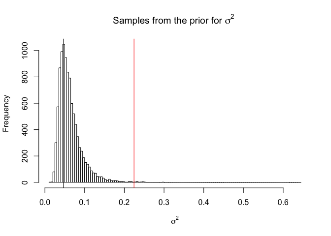
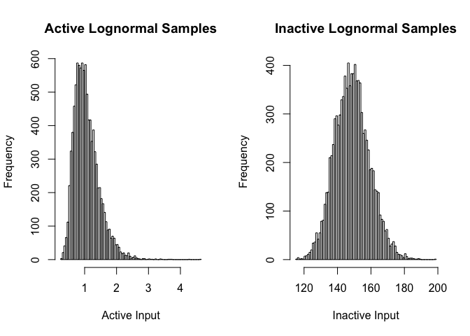
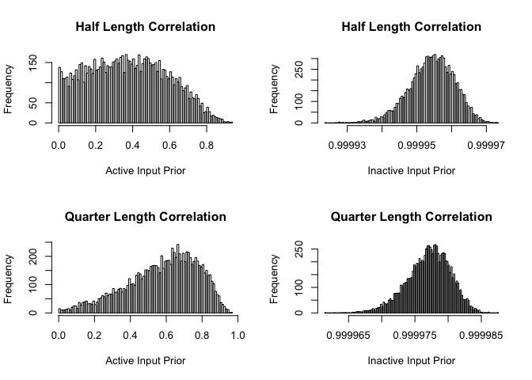

Subjective Bayesian Priors in mogp
----------------------------------

Our R interface to mogp allows users to specify their own subjective
priors for the parameters of each of the emulators they are fitting
simultaneously and in an intuitive way. However, you are able to do this
directly with mogp, so why use our package at all?

The reason is that, absent specific knowledge about the output(s) you
are emulating, most users just want default choices that fit well, with
perhaps a little flexibility (say to indicate that one parameter really
should be active and another shouldn’t). The most common approach is to
fit the hyperparameters by maximum likelihood. This is the approach of
the widely used `dicekriging` package, and the default approach for
`mogp_emulator`. However, maximum likelihood approaches are not
generally appropriate for building emulators, because there is a ridge
on the likelihood surface.

There are 2 potential issues. The first is the confounding between
*σ*<sup>2</sup>, the regression line and the correlation parameters. So,
a regression line close to the least squares estimate, a low
*σ*<sup>2</sup> and a moderate correlation is the solution you would
like, but if *σ*<sup>2</sup> is made large and the correlation made
large, good interpolators (on the ridge of the likelihood surface) are
found whatever line is fit. You can often see this when fitting constant
mean functions, when the fit has a mean parameter that is a long way
from the data. The second is that, whatever the model you are trying to
emulate, it is normally the case that a weakly stationary Gaussian
process is not “generative”, and so the “best” fits to the data (in
terms of the likelihood function) are those with a large variance (often
in the nugget) and with low correlation. An example of the motivating
problem is given below.

### Preliminaries

We start by specifying the directory where `mogp_emulator` is installed
so that the python is correctly imported. Please note that your
directory will be different from mine.

``` r
mogp_dir <- "~/Dropbox/BayesExeter/mogp_emulator"
```

``` r
setwd('..')
source('BuildEmulator/BuildEmulator.R')
```

### The ridge on the GP likelihood surface

First make a simple function to emulate in 1D so we can see what is
happening.

``` r
n_train <- 4
x_scale <- 2
x1 <- seq(from=0.05,to=1.95,length.out = n_train)
y1 <- sqrt(x1)*sin(x1 - x1**2)
x <- data.frame(x1, y1)
plot(x1,y1,xlim=c(0,3),ylim=c(-3,0.5),cex=1.1)
```


``` r
xpreds <- seq(from=0,to=3,length.out = 100)
```

Now build an emulator with a linear mean function and some weakly
informative priors to ensure we get a good fit (this should create the
type of emulator we want automatically and we spend most of this
vignette discussing these prior choices). The nugget is fit adaptively
inside `mogp_emulator` so is set to be as small as possible to get the
numerics to work.

``` r
target_list <- extract_targets(x, target_cols = c("y1"))
inputs <- target_list[[1]]
targets <- target_list[[2]]
inputdict <- target_list[[3]]
mean_func <- "y1 ~ x1"
priors <- list(mogp_priors$NormalPrior(0, 10.),
               mogp_priors$NormalPrior(0, 10),
               mogp_priors$NormalPrior(0., 0.125),
               mogp_priors$InvGammaPrior(2., 1.))
gp <- mogp_emulator$GaussianProcess(inputs, targets,
                                    mean=mean_func,
                                    priors=priors,
                                    nugget="adaptive",
                                    inputdict=inputdict)
p <- mogp_emulator$fit_GP_MAP(gp)
plot(x1,y1,xlim=c(0,3),ylim=c(-3,0.5),cex=1.1)
tpreds <- gp$predict(xpreds,deriv = FALSE)
points(xpreds,tpreds$mean,col=4,type='l')
points(xpreds, tpreds$mean + 2*(sqrt(tpreds$unc)),col=4,type="l",lty=2)
points(xpreds, tpreds$mean - 2*(sqrt(tpreds$unc)),col=4,type="l",lty=2)
```



``` r
p$theta
```

    ## [1] -0.37761909 -0.39385298  0.02827789 -0.97248789 -0.22036307

The blue lines are the mean function and prediction intervals. We can
look at what has been fit here:

    ## [1] "Regression part:  -0.378  +  -0.394 x1"

    ## [1] "Half length correlation: 0.347"

    ## [1] "Quarter length correlation: 0.768"

    ## [1] "Sigma^2 =  0.378"

Now we fit an emulator using maximum likelihood (so we set the priors to
be uniform, as is default in mogp)

``` r
priors <- NULL
gp1 <- mogp_emulator$GaussianProcess(inputs, targets,
                                    mean=mean_func,
                                    nugget="adaptive",
                                    inputdict=inputdict)
p1 <- mogp_emulator$fit_GP_MAP(gp1)

plot(x1,y1,xlim=c(0,3),ylim=c(-3,0.5),cex=1.1)
points(xpreds, p$theta[1] + xpreds*p$theta[2],type='l',col=4,lty=3,lwd=0.5)
tpreds <- gp$predict(xpreds,deriv = FALSE)
points(xpreds,tpreds$mean,col=4,type='l')
points(xpreds, tpreds$mean + 2*(sqrt(tpreds$unc)),col=4,type="l",lty=2)
points(xpreds, tpreds$mean - 2*(sqrt(tpreds$unc)),col=4,type="l",lty=2)
points(xpreds, p1$theta[1] + xpreds*p1$theta[2],type='l',col=2,lty=3,lwd=0.5,)
tpreds1 <- gp1$predict(xpreds,deriv = FALSE)
points(xpreds,tpreds1$mean,col=2,type='l')
points(xpreds, tpreds1$mean + 2*(sqrt(tpreds1$unc)),col=2,type="l",lty=2)
points(xpreds, tpreds1$mean - 2*(sqrt(tpreds1$unc)),col=2,type="l",lty=2)
```



``` r
p1$theta
```

    ## [1]  0.3373245 -0.7418168  4.6400067 -2.6284617  0.8365486

The red lines are the mean and prediction intervals for the maximum
likelihood emulator. Similarly here is what has been fit.

    ## [1] "Regression part:  0.337  +  -0.742 x1"

    ## [1] "Half length correlation: 0"

    ## [1] "Quarter length correlation: 0"

    ## [1] "Sigma^2 =  0.0722"

In this case, it is clear that the maximium likelihood estimate which is
on the likelihood ridge and has a large variance and low correlation
everywhere. The result is an emulator with no predictive power and with
a variance that is too small away from the observations.

Our prior choices are designed to push the emulator away from the
likeilhood ridge, to be weakly informative (rather than uninformative)
and to allow the user the flexibility to adapt some of them,
particularly if they feel some variables should be active/inactive for
particular outputs.

Walking through the ExeterUQ priors.
------------------------------------

We will use the same test data as before and use a linear mean function
to illustrate how we choose our priors, then describe them.

``` r
load("ConvectionModelExample.Rdata")
head(tData)
```

    ##          A_U  A_EPSILON         A_T       Noise
    ## 1 -0.7112332  0.5198038  0.56237588 -0.03849208
    ## 2 -0.2465941 -0.4163290  0.88555390 -0.02695154
    ## 3  0.3333848 -0.1316253  0.30027685 -0.04939970
    ## 4  0.4462722  0.8817862  0.78243180  0.01830642
    ## 5 -0.9065298 -0.3119412 -0.07690085 -0.04815524
    ## 6 -0.4732543  0.3305641 -0.98112145 -0.02420066
    ##   WAVE1_AYOTTE_24SC_zav.400.600.theta_5_6 WAVE1_AYOTTE_24SC_Ay.theta_5_6
    ## 1                                306.1641                     -0.3697345
    ## 2                                306.7235                     -0.5671676
    ## 3                                306.6203                     -0.4999037
    ## 4                                306.3918                     -0.3919627
    ## 5                                306.1552                     -0.3685847
    ## 6                                305.6225                     -0.3485485
    ##   WAVE1_AYOTTE_24SC_zav.400.600.WND_5_6
    ## 1                              13.82073
    ## 2                              12.25888
    ## 3                              11.82482
    ## 4                              11.94844
    ## 5                              14.73021
    ## 6                              13.17205

``` r
Kernel <- "Gaussian"
Choices <- choices.default
Choices
```

    ## $DeltaActiveMean
    ## [1] 0
    ## 
    ## $DeltaActiveSigma
    ## [1] 0.125
    ## 
    ## $DeltaInactiveMean
    ## [1] 5
    ## 
    ## $DeltaInactiveSigma
    ## [1] 0.005
    ## 
    ## $BetaRegressMean
    ## [1] 0
    ## 
    ## $BetaRegressSigma
    ## [1] 10
    ## 
    ## $NuggetProportion
    ## [1] 0.1
    ## 
    ## $Nugget
    ## [1] "fit"
    ## 
    ## $lm.tryFouriers
    ## [1] FALSE
    ## 
    ## $lm.maxOrder
    ## NULL
    ## 
    ## $lm.maxdf
    ## NULL

The default parameters we use to control mogp priors are shown above. We
will go through the implications of each one and discuss what changing
it does. First some preliminaries to fit a linear mean function in the
parameters.

``` r
lastCand <- which(names(tData)=="Noise")
HowManyEmulators <- length(names(tData)) - lastCand
tData <- tData[,c(1:lastCand,(lastCand+1):(lastCand+HowManyEmulators))]
linPredictor <- paste(names(tData)[1:(lastCand-1)],collapse="+")
lm.list = lapply(1:HowManyEmulators, function(k) list(linModel=eval(parse(text=paste("lm(", paste(names(tData[lastCand+k]), linPredictor, sep="~"), ", data=tData)", sep="")))))
ActiveVariableIndices <- lapply(lm.list, function(tlm) names(tData)[1:(lastCand-1)])
summary(lm.list[[1]]$linModel)
```

    ## 
    ## Call:
    ## lm(formula = WAVE1_AYOTTE_24SC_zav.400.600.theta_5_6 ~ A_U + 
    ##     A_EPSILON + A_T, data = tData)
    ## 
    ## Residuals:
    ##      Min       1Q   Median       3Q      Max 
    ## -0.28152 -0.15136 -0.03609  0.07924  0.84547 
    ## 
    ## Coefficients:
    ##              Estimate Std. Error  t value Pr(>|t|)    
    ## (Intercept) 306.46468    0.04160 7366.754  < 2e-16 ***
    ## A_U           0.33186    0.07186    4.618 9.21e-05 ***
    ## A_EPSILON    -0.57679    0.07192   -8.020 1.69e-08 ***
    ## A_T           0.32259    0.07164    4.503 0.000125 ***
    ## ---
    ## Signif. codes:  0 '***' 0.001 '**' 0.01 '*' 0.05 '.' 0.1 ' ' 1
    ## 
    ## Residual standard error: 0.2278 on 26 degrees of freedom
    ## Multiple R-squared:  0.8134, Adjusted R-squared:  0.7918 
    ## F-statistic: 37.77 on 3 and 26 DF,  p-value: 1.267e-09

Now we set the required quantities to call `GetPriors()` so that we can
step through that code to illustrate and discuss our prior choices.

``` r
lm.emulator <- lm.list[[1]]
d <- 3
ActiveVariables <- ActiveVariableIndices[[1]]
```

### Stepping through `GetPriors()`

``` r
p <- length(lm.emulator$linModel$coefficients)-1
Betas <- lapply(1:p, function(e) mogp_priors$NormalPrior(Choices$BetaRegressMean, Choices$BetaRegressSigma))
```

The above sets a *N*(`BetaRegressMean`, `BetaRegressSigma`) prior for
each of the regression coefficients but leaves the intercept as uniorm.
Our default choices are for *N*(0, 10<sup>2</sup>)

``` r
hist(rnorm(10000,Choices$BetaRegressMean,Choices$BetaRegressSigma),breaks=100,main=expression(paste("Samples from the regression coefficient prior for ", beta,sep=" ")),xlab=expression(beta))
```



This is a relatively weak prior that should aid optimisation of MAP. The
most controversial choice (from a subjective Bayesian perspective) is to
allow the intercept to be uniform, but this works well in practice,
particularly over many outputs. Many emulator users have output on a
variety of scales and it is often impractical or undesirable for a
application user to transform the output from the scale they understand
to something more convenient for statistical fitting but less
interpretable.

The prior on the regression coefficients could, if anything, be too
tight, but this situation is rare. If a very large coefficient is
suggested by the preliminary linear fit, this is a flag that something
about the data makeup is unusual and that a different emulation approach
might be required. For example, an input might naturally live on a log
scale and need to be explored over many orders of magnitude. But if the
transformation has not happened at the design stage, the data may have a
dramatic non linear response to that input that requires either a more
bespoke mean function with higher order polynomial terms, or a weaker
prior here.

### Prior variance and nugget

I am typically a fan of Gelman (2006)‘s attitude to \`weakly
informative’ priors for variances being half normal, as they are easier
to think about and to make automatic choices for. This was our approach
in our Stan release.

A price we pay for the speed brought by mogp, is that we lose the
flexibility of prior modelling offered by Stan. We use the inverse gamma
implementation in mogp, and attempt to set an informative prior using
the information from the preliminary fitting we have.

Whilst the prior on the mean function is arguably only important in that
we require sufficient flexibility, the priors on the other parameters
are important as they must overcome the problem with the ridge on the
Gaussian Process likelihood surface described above.

The problem is that our data are not generated from a weakly stationary
Gaussian process and so, in a very many cases, solutions with means very
far from the data, large variances and long correlation lengths - those
on the likelihood ridge - are particularly attractive. Our priors are
designed to penalise this ridge and encourage the emulator to have a
variance that respects the data that we have. Ideally, the mean function
explains some of the total variability in the data, so we have natural
bounds on *σ*<sup>2</sup> from the variability in the data and the
amount of variance we would like to explain.

Though the parameters required by the `mogp_emulator` implementation of
the Inverse Gamma distribution are the usual shape and rate of the
distribution, we reparametrise in terms of the mode and the variance.
Once given the mode and variance, the shape parameter is a root of
*V**x*<sup>3</sup> − (4*V* + *M*<sup>2</sup>)*x*<sup>2</sup> + (5*V* − 2*M*<sup>2</sup>)*x* − (2*V* + *M*<sup>2</sup>),
 and the rate parameter can be computed directly given the shape. Our
`invgamMode` function converts the mode and a bound on *σ*<sup>2</sup>
into the parameters of the inverse gamma distribution by first
considering the number of standard deviations from the mode to the given
bound to be 6 (in order to compute a variance), then solving the above
numerically to obtain the inverse gamma parameters. The subjective
choices are now the mode and bound on the variance, and we have natural
information to use given our preliminary fitting.

We take the bound to be the variance of the data scaled by
`1 - Choices$NuggetProportion`. This prior says that we expect
`Choices$NuggetProportion` of the data variance to be nugget and the
rest to be due to the GP. The argument here is that our bound accounts
for the constant mean case, but we believe some signal to be absorbed by
the mean function. The mode we set to be the variance of the residuals
of our preliminary fit. Effectively this prior allows all variances that
are consistent with the data but has vanishingly small probability for
larger variances that would then force the correlation to be very high
and place us on the likelihood ridge.

In the `GetPriors()` code, first the mode and bound are set, as
described above; the shape and rate are derived by calling to
`invgamMode` and the parameters are passed to the `mogp_priors` module.

``` r
  ModeSig <- var(lm.emulator$linModel$residuals)
  boundSig <- ModeSig/(1-summary(lm.emulator$linModel)$r.squared)
  SigmaParams <- invgamMode((1-Choices$NuggetProportion)*boundSig,ModeSig)
  Sigma <- mogp_priors$InvGammaPrior(SigmaParams$alpha,SigmaParams$beta)
```

We can see the prior for our data here, as well as calculating the prior
probability of exceeding the bound.

``` r
  alphaSig <- SigmaParams$alpha
  betaSig <- SigmaParams$beta
  hist(rinvgamma(10000,alphaSig,betaSig),breaks=100, main = expression(paste("Samples from the prior for ", sigma^2,sep=" ")),xlab=expression(sigma^2))
  abline(v=ModeSig)
  abline(v=(1-Choices$NuggetProportion)*boundSig,col=2)
```



``` r
  print(1-pinvgamma((1-Choices$NuggetProportion)*boundSig,alphaSig,betaSig))
```

    ## [1] 0.002377577

The nugget distribution follows similarly, setting the mode and bound to
be `Choices$NuggetProportion` times those used for *σ*<sup>2</sup>

``` r
NuggetParams <- invgamMode(Choices$NuggetProportion*boundSig ,Choices$NuggetProportion*ModeSig)
    Nugget <- mogp_priors$InvGammaPrior(NuggetParams$alpha, NuggetParams$beta)
```

### Correlation lengths

The correlation lengths are logged throughout `mogp_emulator`, so we set
these logs to have a Normal prior, giving the correlation lengths a log
normal prior. We use the correlation lengths in our prior description to
distinguish between “active” and “inactive” inputs.

In most applications we work in, there are many more inputs than one can
feasibly fit a Gaussian Process with a separable covariance to. The
issue is caused by the curse of dimensionality which basically means
that points one might think of as close together are actually very far
away in many dimensions.

Take for example the squared exponential kernel
$$k(x,x') = \\prod\_{i=1}^d\\exp\\left\\{-\\frac{(x\_i-x'\_i)^2}{\\delta\_i^2}\\right\\},$$
 written as a product of exponentials rather than the usual sum to
illustrate the point. If each dimension contributes a high correlation
(e.g. 0.9), then in 15 dimensions the overall correlation is 0.2 and in
20 it’s 0.12. But further, looking at other combinations of high
correlation, you can see that correlation decays very quickly:

``` r
c(0.7,0.8,0.9)^15
```

    ## [1] 0.004747562 0.035184372 0.205891132

``` r
c(0.7,0.8,0.9)^20
```

    ## [1] 0.0007979227 0.0115292150 0.1215766546

The solution to this has been only to fit the GP part to a subset of
active inputs, with the remainder being inactive (Craig et al. 1996). As
we have a prior on the nugget, (and as the nugget is additive), we
capture the variability from inactive inputs easily, so the main thing
that needs to be achieved is to ensure inactive inputs do not kill the
correlation.

We set our inactive input hyperparameters so that the correlation is
very close to 1. Then, when computing a separable covariance function,
those parameters do not impact on the overall covariance and so are
“effectively” ignored. A different solution would be to remove them and
to reshape all arrays. If all inactive correlations are 1, these
solutions are equivalent.

Note that in the special case of only 1 input that is inactive, this
solution really does not work. However, we assume that a modeller would
not want to fit a GP to a single input and to specify that it is
inactive!

``` r
par(mfrow=c(1,2))
hist(rlnorm(10000,Choices$DeltaActiveMean,sqrt(Choices$DeltaActiveSigma)),breaks=100, main="Active Lognormal Samples",xlab="Active Input")
hist(rlnorm(10000,Choices$DeltaInactiveMean,sqrt(Choices$DeltaInactiveSigma)),breaks=100, main="Inactive Lognormal Samples",xlab="Inactive Input")
```



``` r
par(mfrow=c(2,2))
hist(exp(-1/rlnorm(10000,Choices$DeltaActiveMean,sqrt(Choices$DeltaActiveSigma))^2),breaks=100, main="Half Length Correlation", xlab="Active Input Prior")
hist(exp(-1/rlnorm(10000,Choices$DeltaInactiveMean,sqrt(Choices$DeltaInactiveSigma))^2),breaks=100, main="Half Length Correlation", xlab="Inactive Input Prior")
hist(exp(-.5/rlnorm(10000,Choices$DeltaActiveMean,sqrt(Choices$DeltaActiveSigma))^2),breaks=100, main="Quarter Length Correlation", xlab="Active Input Prior")
hist(exp(-.5/rlnorm(10000,Choices$DeltaInactiveMean,sqrt(Choices$DeltaInactiveSigma))^2),breaks=100, main="Quarter Length Correlation", xlab="Inactive Input Prior")
```


