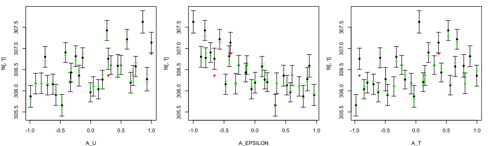

Exeter UQ mogp
--------------

Here we demonstrate implementation of mogp for emulating multiple
outputs with subjective priors and complex mean functions.

### Preliminaries

First we specify the directory where mogp is installed so that the
python is correctly imported. Your directory will be different from
mine.

``` r
mogp_dir <- "~/Dropbox/BayesExeter/mogp_emulator"
```

``` r
setwd("..")
source("BuildEmulator/BuildEmulator.R")
```

This source should add the required package dependencies. Many of these
are for plotting for types of UQ not yet available with this simple mogp
implementation (like Basis emulation), but coming soon here.

### Data format

Our implementation of mogp is so simple to engage with for users because
a lot of the complicated specification is handled inside the code using
the structure of the data object. Here is a compatible data set:

``` r
load("ConvectionModelExample.Rdata")
head(tData)
```

    ##          A_U  A_EPSILON         A_T       Noise
    ## 1 -0.7112332  0.5198038  0.56237588 -0.03849208
    ## 2 -0.2465941 -0.4163290  0.88555390 -0.02695154
    ## 3  0.3333848 -0.1316253  0.30027685 -0.04939970
    ## 4  0.4462722  0.8817862  0.78243180  0.01830642
    ## 5 -0.9065298 -0.3119412 -0.07690085 -0.04815524
    ## 6 -0.4732543  0.3305641 -0.98112145 -0.02420066
    ##   WAVE1_AYOTTE_24SC_zav.400.600.theta_5_6 WAVE1_AYOTTE_24SC_Ay.theta_5_6
    ## 1                                306.1641                     -0.3697345
    ## 2                                306.7235                     -0.5671676
    ## 3                                306.6203                     -0.4999037
    ## 4                                306.3918                     -0.3919627
    ## 5                                306.1552                     -0.3685847
    ## 6                                305.6225                     -0.3485485
    ##   WAVE1_AYOTTE_24SC_zav.400.600.WND_5_6
    ## 1                              13.82073
    ## 2                              12.25888
    ## 3                              11.82482
    ## 4                              11.94844
    ## 5                              14.73021
    ## 6                              13.17205

The data here are simulations from a single column convection model.
There are some very important features of the data structure:

1.  It is called `tData`.
2.  The columns are named.
3.  The columns before `Noise` are the input variables.
4.  The columns after `Noise` are the output variables.
5.  The `Noise` column is there and is a vector of random draws from a
    simple distribution. We often use `rnorm(N,0,0.5)` to have values in
    the region \[-1,1\] (not completely restricted), but uniform
    \[-1,1\] would work fine too.
6.  The inputs have been scaled to \[-1,1\]. It is fine to use other
    scalings with our code (e.g. \[0,1\]), but we use \[-1,1\] in
    practice and our history matching plotting code normally relies on
    this fact. We would advise scaling to \[-1,1\] as this makes sense
    with our prior specification.

To engage with our code with your own data, simply create this “Noise”
vector with `rnorm` (or your favourite random number generator) and then
stitch your inputs outputs and noise together with (not evaluated):

``` r
tData <- cbind(inputs, Noise, outputs)
```

### Building mogp emulators

The call to build an mogp emulator is below. It will build our custom
mogp emulator for all 3 outputs simultaneously, using all of our default
specifications for kernels, means etc. The visable output represents the
fitting of our custom mean functions to each output. For those
experienced statisiticians you can get an idea of what the key features
of the data are from looking at this output. Note the new version
defaults to a linear mean in the parameters, but we reccommend a fitted
mean.

``` r
TestEm <- BuildNewEmulators(tData, HowManyEmulators = 3, meanFun="fitted") 
```

    ## [1] "Max reduction is 0.141510566268957 using A_EPSILON"
    ## [1] "Max reduction is 0.0719279431890675 using A_U"
    ## [1] "Max reduction is 0.0593934956606317 using A_T"
    ## [1] "Max reduction is 0.0841015596079704 using A_EPSILON"
    ## [1] "Max reduction is 0.0215815680504046 using A_EPSILON"
    ## [1] "Max reduction is 0.0221974794878812 using A_EPSILON"
    ## [1] "Noise fitted, stopping algorithm"
    ## 
    ## Call:
    ## lm(formula = WAVE1_AYOTTE_24SC_zav.400.600.theta_5_6 ~ A_EPSILON + 
    ##     I(A_EPSILON^2) + I(A_EPSILON^3) + I(A_EPSILON^4) + A_U + 
    ##     A_T + I(A_U * A_EPSILON) + I(A_T * A_EPSILON) + I(A_T * A_U), 
    ##     data = tData)
    ## 
    ## Residuals:
    ##      Min       1Q   Median       3Q      Max 
    ## -0.15059 -0.06624  0.01615  0.05931  0.15216 
    ## 
    ## Coefficients:
    ##                     Estimate Std. Error  t value Pr(>|t|)    
    ## (Intercept)        306.35982    0.03461 8852.437  < 2e-16 ***
    ## A_EPSILON           -0.31275    0.08180   -3.824  0.00106 ** 
    ## I(A_EPSILON^2)      -0.19500    0.21788   -0.895  0.38145    
    ## I(A_EPSILON^3)      -0.43915    0.12490   -3.516  0.00217 ** 
    ## I(A_EPSILON^4)       0.83401    0.24582    3.393  0.00289 ** 
    ## A_U                  0.30423    0.03234    9.409 8.73e-09 ***
    ## A_T                  0.33990    0.03172   10.715 9.78e-10 ***
    ## I(A_U * A_EPSILON)  -0.08042    0.05404   -1.488  0.15233    
    ## I(A_T * A_EPSILON)  -0.08069    0.06159   -1.310  0.20500    
    ## I(A_T * A_U)        -0.03824    0.06560   -0.583  0.56648    
    ## ---
    ## Signif. codes:  0 '***' 0.001 '**' 0.01 '*' 0.05 '.' 0.1 ' ' 1
    ## 
    ## Residual standard error: 0.09867 on 20 degrees of freedom
    ## Multiple R-squared:  0.9731, Adjusted R-squared:  0.961 
    ## F-statistic: 80.31 on 9 and 20 DF,  p-value: 1.004e-13
    ## 
    ## 
    ## Call:
    ## lm(formula = WAVE1_AYOTTE_24SC_zav.400.600.theta_5_6 ~ A_EPSILON + 
    ##     I(A_EPSILON^2) + I(A_EPSILON^3) + I(A_EPSILON^4) + A_U + 
    ##     A_T + I(A_U * A_EPSILON) + I(A_T * A_EPSILON) + I(A_T * A_U), 
    ##     data = tData)
    ## 
    ## Residuals:
    ##      Min       1Q   Median       3Q      Max 
    ## -0.15059 -0.06624  0.01615  0.05931  0.15216 
    ## 
    ## Coefficients:
    ##                     Estimate Std. Error  t value Pr(>|t|)    
    ## (Intercept)        306.35982    0.03461 8852.437  < 2e-16 ***
    ## A_EPSILON           -0.31275    0.08180   -3.824  0.00106 ** 
    ## I(A_EPSILON^2)      -0.19500    0.21788   -0.895  0.38145    
    ## I(A_EPSILON^3)      -0.43915    0.12490   -3.516  0.00217 ** 
    ## I(A_EPSILON^4)       0.83401    0.24582    3.393  0.00289 ** 
    ## A_U                  0.30423    0.03234    9.409 8.73e-09 ***
    ## A_T                  0.33990    0.03172   10.715 9.78e-10 ***
    ## I(A_U * A_EPSILON)  -0.08042    0.05404   -1.488  0.15233    
    ## I(A_T * A_EPSILON)  -0.08069    0.06159   -1.310  0.20500    
    ## I(A_T * A_U)        -0.03824    0.06560   -0.583  0.56648    
    ## ---
    ## Signif. codes:  0 '***' 0.001 '**' 0.01 '*' 0.05 '.' 0.1 ' ' 1
    ## 
    ## Residual standard error: 0.09867 on 20 degrees of freedom
    ## Multiple R-squared:  0.9731, Adjusted R-squared:  0.961 
    ## F-statistic: 80.31 on 9 and 20 DF,  p-value: 1.004e-13
    ## 
    ## [1] "1 I(A_T * A_U)"
    ## [1] "2 I(A_T * A_EPSILON)"
    ## [1] "3 I(A_U * A_EPSILON)"
    ## [1] "4 I(A_EPSILON^4)"
    ## [1] "5 I(A_EPSILON^3)"
    ## 
    ## Call:
    ## lm(formula = WAVE1_AYOTTE_24SC_zav.400.600.theta_5_6 ~ A_EPSILON + 
    ##     I(A_EPSILON^2) + A_U + A_T, data = tData)
    ## 
    ## Residuals:
    ##      Min       1Q   Median       3Q      Max 
    ## -0.31141 -0.07230  0.00132  0.06857  0.49418 
    ## 
    ## Coefficients:
    ##                 Estimate Std. Error  t value Pr(>|t|)    
    ## (Intercept)    306.28286    0.04193 7304.864  < 2e-16 ***
    ## A_EPSILON       -0.57626    0.04796  -12.015 7.00e-12 ***
    ## I(A_EPSILON^2)   0.53877    0.09315    5.784 4.98e-06 ***
    ## A_U              0.32558    0.04794    6.792 4.06e-07 ***
    ## A_T              0.34208    0.04790    7.142 1.74e-07 ***
    ## ---
    ## Signif. codes:  0 '***' 0.001 '**' 0.01 '*' 0.05 '.' 0.1 ' ' 1
    ## 
    ## Residual standard error: 0.152 on 25 degrees of freedom
    ## Multiple R-squared:  0.9202, Adjusted R-squared:  0.9074 
    ## F-statistic: 72.06 on 4 and 25 DF,  p-value: 2.36e-13
    ## 
    ## [1] "Max reduction is 0.0516838339369975 using A_EPSILON"
    ## [1] "Max reduction is 0.0181512292708917 using A_T"
    ## [1] "Max reduction is 0.00908627733663028 using A_U"
    ## [1] "Noise fitted, stopping algorithm"
    ## 
    ## Call:
    ## lm(formula = WAVE1_AYOTTE_24SC_Ay.theta_5_6 ~ A_EPSILON + A_T + 
    ##     A_U + I(A_T * A_EPSILON) + I(A_U * A_EPSILON) + I(A_U * A_T), 
    ##     data = tData)
    ## 
    ## Residuals:
    ##       Min        1Q    Median        3Q       Max 
    ## -0.122972 -0.017118  0.003162  0.026879  0.108563 
    ## 
    ## Coefficients:
    ##                     Estimate Std. Error t value Pr(>|t|)    
    ## (Intercept)        -0.466705   0.009108 -51.243  < 2e-16 ***
    ## A_EPSILON           0.173565   0.015924  10.900 1.47e-10 ***
    ## A_T                -0.078502   0.015793  -4.971 5.01e-05 ***
    ## A_U                -0.050460   0.015915  -3.171  0.00427 ** 
    ## I(A_T * A_EPSILON)  0.066547   0.030606   2.174  0.04022 *  
    ## I(A_U * A_EPSILON) -0.025424   0.025766  -0.987  0.33405    
    ## I(A_U * A_T)       -0.035683   0.031953  -1.117  0.27564    
    ## ---
    ## Signif. codes:  0 '***' 0.001 '**' 0.01 '*' 0.05 '.' 0.1 ' ' 1
    ## 
    ## Residual standard error: 0.0496 on 23 degrees of freedom
    ## Multiple R-squared:  0.8819, Adjusted R-squared:  0.8511 
    ## F-statistic: 28.62 on 6 and 23 DF,  p-value: 1.439e-09
    ## 
    ## 
    ## Call:
    ## lm(formula = WAVE1_AYOTTE_24SC_Ay.theta_5_6 ~ A_EPSILON + A_T + 
    ##     A_U + I(A_T * A_EPSILON) + I(A_U * A_EPSILON) + I(A_U * A_T), 
    ##     data = tData)
    ## 
    ## Residuals:
    ##       Min        1Q    Median        3Q       Max 
    ## -0.122972 -0.017118  0.003162  0.026879  0.108563 
    ## 
    ## Coefficients:
    ##                     Estimate Std. Error t value Pr(>|t|)    
    ## (Intercept)        -0.466705   0.009108 -51.243  < 2e-16 ***
    ## A_EPSILON           0.173565   0.015924  10.900 1.47e-10 ***
    ## A_T                -0.078502   0.015793  -4.971 5.01e-05 ***
    ## A_U                -0.050460   0.015915  -3.171  0.00427 ** 
    ## I(A_T * A_EPSILON)  0.066547   0.030606   2.174  0.04022 *  
    ## I(A_U * A_EPSILON) -0.025424   0.025766  -0.987  0.33405    
    ## I(A_U * A_T)       -0.035683   0.031953  -1.117  0.27564    
    ## ---
    ## Signif. codes:  0 '***' 0.001 '**' 0.01 '*' 0.05 '.' 0.1 ' ' 1
    ## 
    ## Residual standard error: 0.0496 on 23 degrees of freedom
    ## Multiple R-squared:  0.8819, Adjusted R-squared:  0.8511 
    ## F-statistic: 28.62 on 6 and 23 DF,  p-value: 1.439e-09
    ## 
    ## [1] "1 I(A_U * A_EPSILON)"
    ## [1] "2 I(A_U * A_T)"
    ## 
    ## Call:
    ## lm(formula = WAVE1_AYOTTE_24SC_Ay.theta_5_6 ~ A_EPSILON + A_T + 
    ##     A_U + I(A_T * A_EPSILON), data = tData)
    ## 
    ## Residuals:
    ##       Min        1Q    Median        3Q       Max 
    ## -0.125503 -0.019057  0.002386  0.026174  0.097011 
    ## 
    ## Coefficients:
    ##                     Estimate Std. Error t value Pr(>|t|)    
    ## (Intercept)        -0.466250   0.009099 -51.240  < 2e-16 ***
    ## A_EPSILON           0.175425   0.015790  11.110 3.68e-11 ***
    ## A_T                -0.076189   0.015710  -4.850 5.50e-05 ***
    ## A_U                -0.052910   0.015894  -3.329   0.0027 ** 
    ## I(A_T * A_EPSILON)  0.064706   0.030065   2.152   0.0412 *  
    ## ---
    ## Signif. codes:  0 '***' 0.001 '**' 0.01 '*' 0.05 '.' 0.1 ' ' 1
    ## 
    ## Residual standard error: 0.04981 on 25 degrees of freedom
    ## Multiple R-squared:  0.8705, Adjusted R-squared:  0.8498 
    ## F-statistic: 42.01 on 4 and 25 DF,  p-value: 9.526e-11
    ## 
    ## [1] "Max reduction is 0.482408369617749 using A_U"
    ## [1] "Max reduction is 0.218319375740367 using A_U"
    ## [1] "Max reduction is 0.125730158685294 using A_EPSILON"
    ## [1] "Max reduction is 0.0997702118329568 using A_U"
    ## [1] "Max reduction is 0.0271958533098509 using A_U"
    ## [1] "Max reduction is 0.0170111124043587 using A_U"
    ## [1] "Max reduction is 0.00102285247477041 using A_EPSILON"
    ## [1] "Max reduction is 0.0269160398536438 using Three Way Interactions with A_EPSILON"
    ## [1] "Max reduction is 0.017685867543131 using A_T"
    ## [1] "No further terms permitted with the given degrees of freedom"
    ## 
    ## Call:
    ## lm(formula = WAVE1_AYOTTE_24SC_zav.400.600.WND_5_6 ~ A_U + I(A_U^2) + 
    ##     I(A_U^3) + I(A_U^4) + I(A_U^5) + A_EPSILON + I(A_EPSILON^2) + 
    ##     A_T + I(A_EPSILON * A_U) + I(A_T * A_U) + I(A_T * A_EPSILON) + 
    ##     I(A_EPSILON * A_EPSILON * A_U) + I(A_EPSILON * A_T * A_U) + 
    ##     I(A_EPSILON * A_T * A_EPSILON), data = tData)
    ## 
    ## Residuals:
    ##       Min        1Q    Median        3Q       Max 
    ## -0.096819 -0.014154  0.003559  0.029044  0.061739 
    ## 
    ## Coefficients:
    ##                                Estimate Std. Error t value Pr(>|t|)    
    ## (Intercept)                    12.14491    0.02127 570.984  < 2e-16 ***
    ## A_U                            -1.19660    0.07737 -15.466 1.26e-10 ***
    ## I(A_U^2)                        0.49853    0.11485   4.341 0.000582 ***
    ## I(A_U^3)                        0.04079    0.29706   0.137 0.892609    
    ## I(A_U^4)                        1.02544    0.12295   8.340 5.14e-07 ***
    ## I(A_U^5)                       -1.08677    0.24586  -4.420 0.000496 ***
    ## A_EPSILON                       0.31898    0.01865  17.100 3.01e-11 ***
    ## I(A_EPSILON^2)                 -0.13457    0.03630  -3.707 0.002109 ** 
    ## A_T                            -0.02568    0.02879  -0.892 0.386454    
    ## I(A_EPSILON * A_U)             -0.38773    0.03026 -12.814 1.75e-09 ***
    ## I(A_T * A_U)                    0.11796    0.03987   2.959 0.009760 ** 
    ## I(A_T * A_EPSILON)             -0.04880    0.03605  -1.354 0.195903    
    ## I(A_EPSILON * A_EPSILON * A_U)  0.38672    0.06230   6.208 1.68e-05 ***
    ## I(A_EPSILON * A_T * A_U)        0.11912    0.09194   1.296 0.214675    
    ## I(A_EPSILON * A_T * A_EPSILON)  0.06014    0.08302   0.724 0.479946    
    ## ---
    ## Signif. codes:  0 '***' 0.001 '**' 0.01 '*' 0.05 '.' 0.1 ' ' 1
    ## 
    ## Residual standard error: 0.05397 on 15 degrees of freedom
    ## Multiple R-squared:  0.9987, Adjusted R-squared:  0.9975 
    ## F-statistic:   813 on 14 and 15 DF,  p-value: < 2.2e-16
    ## 
    ## [1] "1 I(A_EPSILON * A_T * A_EPSILON)"
    ## [1] "2 I(A_T * A_EPSILON)"
    ## 
    ## Call:
    ## lm(formula = WAVE1_AYOTTE_24SC_zav.400.600.WND_5_6 ~ A_U + I(A_U^2) + 
    ##     I(A_U^3) + I(A_U^4) + I(A_U^5) + A_EPSILON + I(A_EPSILON^2) + 
    ##     A_T + I(A_EPSILON * A_U) + I(A_T * A_U) + I(A_EPSILON * A_EPSILON * 
    ##     A_U) + I(A_EPSILON * A_T * A_U), data = tData)
    ## 
    ## Residuals:
    ##       Min        1Q    Median        3Q       Max 
    ## -0.100346 -0.022345  0.004853  0.026981  0.085676 
    ## 
    ## Coefficients:
    ##                                Estimate Std. Error t value Pr(>|t|)    
    ## (Intercept)                    12.14806    0.02138 568.288  < 2e-16 ***
    ## A_U                            -1.20582    0.07347 -16.413 7.36e-12 ***
    ## I(A_U^2)                        0.48268    0.11484   4.203 0.000598 ***
    ## I(A_U^3)                        0.09328    0.28155   0.331 0.744448    
    ## I(A_U^4)                        1.03694    0.12313   8.422 1.80e-07 ***
    ## I(A_U^5)                       -1.13282    0.23941  -4.732 0.000193 ***
    ## A_EPSILON                       0.32289    0.01861  17.351 3.01e-12 ***
    ## I(A_EPSILON^2)                 -0.14090    0.03560  -3.958 0.001015 ** 
    ## A_T                            -0.01237    0.01781  -0.694 0.496884    
    ## I(A_EPSILON * A_U)             -0.39676    0.02984 -13.295 2.07e-10 ***
    ## I(A_T * A_U)                    0.13192    0.03907   3.376 0.003589 ** 
    ## I(A_EPSILON * A_EPSILON * A_U)  0.39776    0.05808   6.848 2.83e-06 ***
    ## I(A_EPSILON * A_T * A_U)        0.10485    0.08882   1.180 0.254096    
    ## ---
    ## Signif. codes:  0 '***' 0.001 '**' 0.01 '*' 0.05 '.' 0.1 ' ' 1
    ## 
    ## Residual standard error: 0.05457 on 17 degrees of freedom
    ## Multiple R-squared:  0.9985, Adjusted R-squared:  0.9974 
    ## F-statistic: 927.6 on 12 and 17 DF,  p-value: < 2.2e-16
    ## 
    ## [1] "1 I(A_EPSILON * A_T * A_U)"
    ## [1] "2 I(A_EPSILON^2)"
    ## [1] "3 I(A_T * A_U)"

    ## Warning in all(lapply(ThreeWayInters, function(e) (all(e[variableNum, ] < :
    ## coercing argument of type 'list' to logical

    ## [1] "4 A_T"
    ## [1] "5 I(A_EPSILON * A_EPSILON * A_U)"
    ## [1] "6 I(A_U^5)"
    ## [1] "7 I(A_U^4)"
    ## [1] "8 I(A_EPSILON * A_U)"
    ## 
    ## Call:
    ## lm(formula = WAVE1_AYOTTE_24SC_zav.400.600.WND_5_6 ~ A_U + I(A_U^2) + 
    ##     I(A_U^3) + A_EPSILON, data = tData)
    ## 
    ## Residuals:
    ##      Min       1Q   Median       3Q      Max 
    ## -0.70366 -0.10215  0.00988  0.08980  0.42528 
    ## 
    ## Coefficients:
    ##             Estimate Std. Error t value Pr(>|t|)    
    ## (Intercept) 12.00348    0.06088 197.177  < 2e-16 ***
    ## A_U         -0.75201    0.16969  -4.432 0.000163 ***
    ## I(A_U^2)     1.44290    0.13363  10.798 6.66e-11 ***
    ## I(A_U^3)    -1.24241    0.25153  -4.939 4.36e-05 ***
    ## A_EPSILON    0.32197    0.07089   4.542 0.000122 ***
    ## ---
    ## Signif. codes:  0 '***' 0.001 '**' 0.01 '*' 0.05 '.' 0.1 ' ' 1
    ## 
    ## Residual standard error: 0.2234 on 25 degrees of freedom
    ## Multiple R-squared:  0.9624, Adjusted R-squared:  0.9564 
    ## F-statistic:   160 on 4 and 25 DF,  p-value: < 2.2e-16

The models here are accessible as part of the output of
BuildNewEmulators.

``` r
names(TestEm)
```

    ## [1] "mogp"             "fitting.elements"

The `mogp` element is the mogp emulator; a multi-output emulator that
can be evaluated for millions of predictions across all outputs
incredibly quickly (about 5s per million predictions on my laptop for
this data).

To run your own predictions, the call is

``` r
newDesign <- 2*randomLHS(10000,3)-1
preds <- TestEm$mogp$predict(newDesign, deriv=FALSE)
```

You get access to the mean via

``` r
tmean <- preds$mean
dim(tmean)
```

    ## [1]     3 10000

where the mean is `HowManyEmulators` by `10000`. The variance is

``` r
tvar <- preds$unc
dim(tvar)
```

    ## [1]     3 10000

with the same dimensions as the mean. There is no customisation in this
repository for prediction. I.e. you can engage with TestEm$mogp as with
any mogp object.

The `fitting.elements` part contains the control options that were used
in the fitting (and these can be changed as inputs to
BuildNewEmulators), and can help with diagnostics

``` r
names(TestEm$fitting.elements)
```

    ## [1] "lm.object"     "Design"        "ActiveIndices" "PriorChoices"

-   The `lm.object` contains a list of the mean functions that were
    fitted, one for each emulator. Useful to see what parameters are
    involved, how global the fit is, etc.
-   `Design` is the design matrix and is useful for plotting
-   `ActiveIndices` is a list of vectors of indices that indicate which
    inputs were used in each emulator (you don’t always want to fit on
    all inputs and in particular in 10-20 dimensions!)
-   `PriorChoices` is a list of the prior choices that were used in the
    fitting of each emulator. Some are explained below and the code
    itself documents these carefully.

### Validation and customisation

A separate vignette will present diagnostic plotting more thoroughly.
Leave one outs are available via

``` r
tLOOs <- LOO.plot(Emulators = TestEm, which.emulator = 1,
                  ParamNames = names(TestEm$fitting.elements$Design))
```



If there are issues with the fit, or even if you want to change some of
our custom settings, we offer some of the basics here and a more
detailed tutorial will come soon. You can also read the documentation in
our code which is detailed and justifies many of our prior choices.

#### Different mean functions

Many prefer not to have custom mean functions, but to use linear means.
The option `meanFun` in `BuildNewEmulators` allows this as follows

``` r
TestEmLinear <- BuildNewEmulators(tData, 3, 
                                  additionalVariables = names(tData)[1:3], 
                                  meanFun = "linear")
```

The default option is `meanFun="fitted"` which engages our customised
fitting code. For example

``` r
summary(TestEmLinear$fitting.elements$lm.object[[1]]$linModel)
```

    ## 
    ## Call:
    ## lm(formula = WAVE1_AYOTTE_24SC_zav.400.600.theta_5_6 ~ A_U + 
    ##     A_EPSILON + A_T, data = tData)
    ## 
    ## Residuals:
    ##      Min       1Q   Median       3Q      Max 
    ## -0.28152 -0.15136 -0.03609  0.07924  0.84547 
    ## 
    ## Coefficients:
    ##              Estimate Std. Error  t value Pr(>|t|)    
    ## (Intercept) 306.46468    0.04160 7366.754  < 2e-16 ***
    ## A_U           0.33186    0.07186    4.618 9.21e-05 ***
    ## A_EPSILON    -0.57679    0.07192   -8.020 1.69e-08 ***
    ## A_T           0.32259    0.07164    4.503 0.000125 ***
    ## ---
    ## Signif. codes:  0 '***' 0.001 '**' 0.01 '*' 0.05 '.' 0.1 ' ' 1
    ## 
    ## Residual standard error: 0.2278 on 26 degrees of freedom
    ## Multiple R-squared:  0.8134, Adjusted R-squared:  0.7918 
    ## F-statistic: 37.77 on 3 and 26 DF,  p-value: 1.267e-09

We do not *yet* have custom formulae in this interface, but the
implementation is simple and is coming as mogp does allow for this. The
difficulty with custom mean functions is customising for multiple
outputs automatically.

The fitting of our mean functions broadly follows a forwards and
backwards stepwise regression using the Draper and Smith (1989) and is
described in a number of places (Williamson et al. 2013, Climate
Dynamics is one place). However, we offer a lot of control over this
through the control parameters. The default controls are here:

``` r
choices.default
```

    ## $DeltaActiveMean
    ## [1] 0
    ## 
    ## $DeltaActiveSigma
    ## [1] 0.125
    ## 
    ## $DeltaInactiveMean
    ## [1] 5
    ## 
    ## $DeltaInactiveSigma
    ## [1] 0.005
    ## 
    ## $BetaRegressMean
    ## [1] 0
    ## 
    ## $BetaRegressSigma
    ## [1] 10
    ## 
    ## $NuggetProportion
    ## [1] 0.1
    ## 
    ## $Nugget
    ## [1] "fit"
    ## 
    ## $lm.tryFouriers
    ## [1] FALSE
    ## 
    ## $lm.maxOrder
    ## NULL
    ## 
    ## $lm.maxdf
    ## NULL

To expand the search for good mean functions to include periodic terms
set

``` r
choices.new <- choices.default
choices.new$lm.tryFouriers=TRUE
```

To cap the order of fitted polynomial, say to quadratic

``` r
choices.new$lm.maxOrder = 2
```

To expand or reduce the number of degrees of freedom that can be used in
fitting a mean function, say to set it to 4

``` r
choices.new$lm.maxdf = 4
```

Changed choices are then inputted as

``` r
newTest <- BuildNewEmulators(tData, HowManyEmulators = 3, 
                             Choices = choices.new) 
```

#### Different Kernels

An mogp defaults to squared exponential kernels and these are given type
`"Gaussian"`. A number of other kernels are made available with mogp
too. Currently we have made the matern 52 available and more can be
added on request if compatible with mogp. Custom kernels added to your
own mogp installation could be supported in the future.

To specify the kernel for each emulator an example call is

``` r
newTest <- BuildNewEmulators(tData, HowManyEmulators = 3, 
                            kernel = c("Gaussian", "Gaussian",
                            "Matern52")) 
```

Note that specifying a single name will recycle the named kernel over
all emulators.

#### Changing prior distributions

The Choices list controls all of the hyperparameters for the priors we
use. Another vignette will be used to demonstrate the priors we have
used and to explore and justify them. The code itself is well documented
and our choice of prior is given and defaults are justified. Our main
goal with these priors is to penalise the ridge on the likelihood
surface of the GP to ensure we have a posterior predictive model that
does not revert quickly to a non-informative prior and is therefore very
poor at extrapolation. Our 2nd goal is to model active and inactive
inputs differently.

We have not made changing the prior distribution types available, though
a bespoke use of mogp allows for this within a few coded distributional
classes. We do allow different default hyperparameters to be passed. For
example, one can inflate the prior variance on all regression parameters
via

``` r
choices.new$BetaRegressSigma = 100
```

For more on priors, see the vignette on subjective priors.
