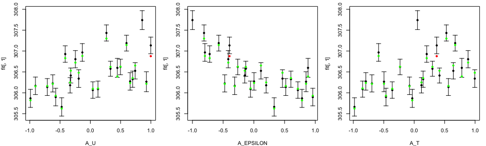
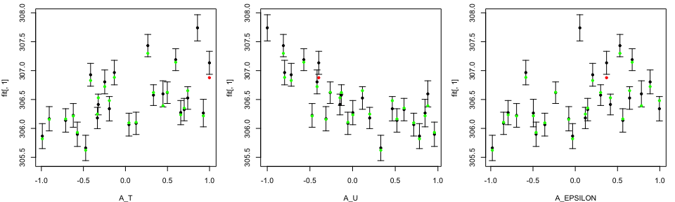
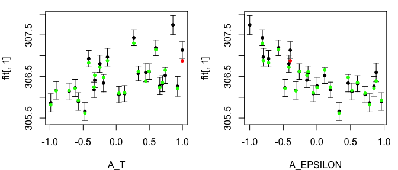
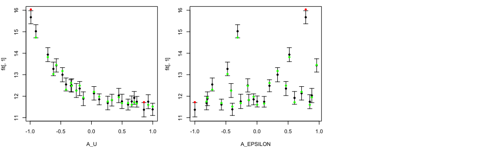
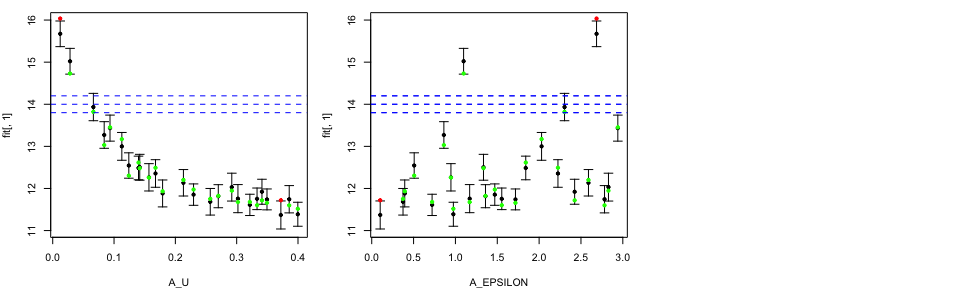
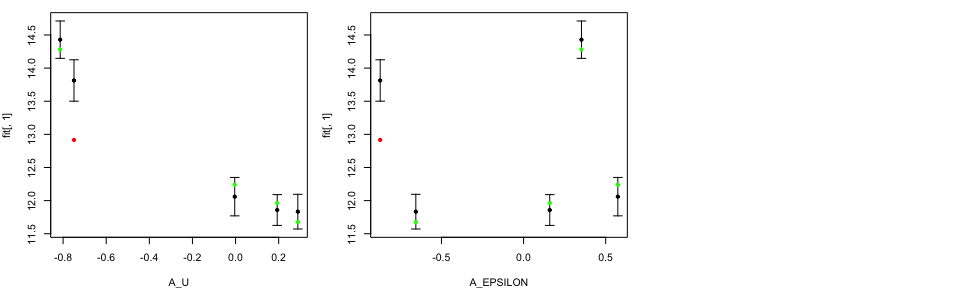
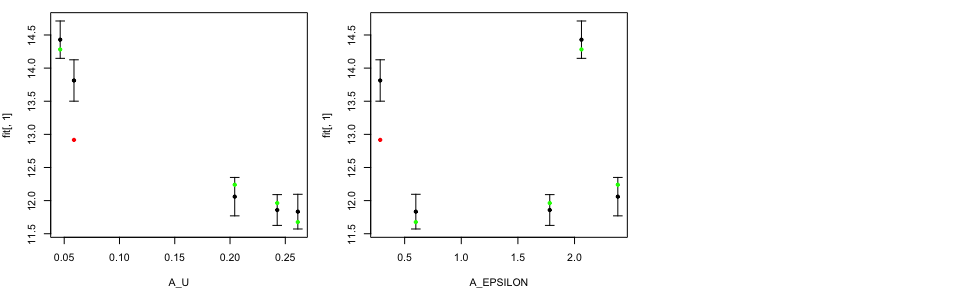
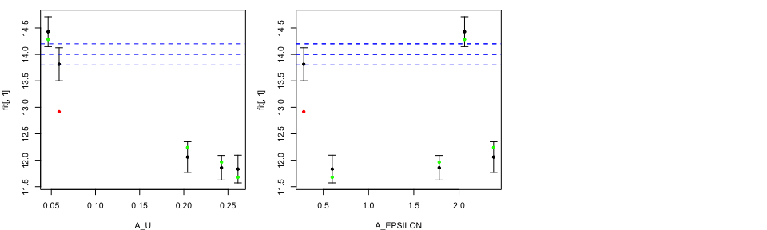

This vignette is aiming to demonstrate how to perform diagnostics for
emulator object obtained with ExeterUQ MOGP.

### Preliminaries

First we specify the directory where mogp is installed so that the
python is correctly imported. Your directory will be different from
mine.

``` r
mogp_dir <- "~/Dropbox/BayesExeter/mogp_emulator"
```

``` r
setwd('..')
source('BuildEmulator/BuildEmulator.R')
```

The description of data format and how to build mogp emulators are
considered in detail in other vignettes.

We start by loading a `.Rdata` file, which contains a data frame object
`tData`. The first three columns correspond to the input parameters,
while the last three columns after the `Noise` correspond to the model
outputs (metrics of interest). We retain the first 25 points as our
training set, and the last 5 points will be used for validation.

``` r
load("ConvectionModelExample.Rdata")
names(tData)
```

    ## [1] "A_U"                                    
    ## [2] "A_EPSILON"                              
    ## [3] "A_T"                                    
    ## [4] "Noise"                                  
    ## [5] "WAVE1_AYOTTE_24SC_zav.400.600.theta_5_6"
    ## [6] "WAVE1_AYOTTE_24SC_Ay.theta_5_6"         
    ## [7] "WAVE1_AYOTTE_24SC_zav.400.600.WND_5_6"

``` r
cands <- names(tData)[1:3]
print(cands)
```

    ## [1] "A_U"       "A_EPSILON" "A_T"

``` r
tData.train <- tData[1:25, ]
tData.valid <- tData[26:30, ]
```

We proceed to construct a GP emulator with default settings for all
three model outputs.

``` r
TestEm <- BuildNewEmulators(tData = tData.train, HowManyEmulators = 3, meanFun="fitted")
```

### Leave-One-Out (LOO) diagnostics

After generating a GP object, we perform Leave-One-Out (LOO)
diagnostics. We specify our obtained GP object as `Emulators` argument
of `LOO.plot` function. We define the index of the emulator for which we
want to produce LOO diagnostics plot `which.emulator`, i.e. we are
interested to produce diagnostics for the first emulator. `ParamNames`
is a vector of names of input parameters.

``` r
tLOOs <- LOO.plot(Emulators = TestEm, which.emulator = 1,
                  ParamNames = cands)
```



``` r
print(head(tLOOs))
```

    ##   posterior mean lower quantile upper quantile
    ## 1       306.1381       305.9355       306.3407
    ## 2       306.8048       306.5984       307.0112
    ## 3       306.5761       306.3967       306.7556
    ## 4       306.5974       306.3710       306.8239
    ## 5       306.1671       305.9572       306.3769
    ## 6       305.6620       305.4429       305.8812

In the LOO diagnostics plot, the black dots and error bars show
predictions together with two standard deviation prediction intervals,
while the green/red points are the true model output coloured by whether
or not the truth lies within the error bars.

By calling `LOO.plot` function, we also obtain a data frame with three
columns, with first column corresponding to posterior mean, and second
and third columns corresponding to the minus and plus two standard
deviations.

We can change the order and/or the number of input parameters in
`ParamNames` specification.

``` r
tLOOs <- LOO.plot(Emulators = TestEm, which.emulator = 1,
                  ParamNames = c("A_T", "A_U", "A_EPSILON"))
```



``` r
tLOOs <- LOO.plot(Emulators = TestEm, which.emulator = 1,
                  ParamNames = c("A_T", "A_EPSILON"))
```



Notice that by choosing to produce LOO plot for the third emulator, we
only have two input variables in our LOO diagnostics plots, since only
these two input variables are active.

``` r
tLOOs <- LOO.plot(Emulators = TestEm, which.emulator = 3,
                  ParamNames = cands)
head(TestEm$fitting$Design[, TestEm$fitting$ActiveIndices[[3]]])
```

    ##          A_U  A_EPSILON
    ## 1 -0.7112332  0.5198038
    ## 2 -0.2465941 -0.4163290
    ## 3  0.3333848 -0.1316253
    ## 4  0.4462722  0.8817862
    ## 5 -0.9065298 -0.3119412
    ## 6 -0.4732543  0.3305641



#### LOO plots on original scale

Modellers are interested in studying these plots on the original
parameter scale. With `LOO.plot` function, they have an option to
specify `OriginalRange=TRUE`. Those ranges are read from a file
containing the parameters ranges and whether the parameters are logged
or not. The string that corresponds to the name of this file is provided
in `RangeFile`.

``` r
tLOOs <- LOO.plot(Emulators = TestEm, which.emulator = 3,
                  ParamNames = names(TestEm$fitting.elements$Design), 
                  OriginalRanges = TRUE, RangeFile="ModelParam.R")
```


#### LOO plots with Observation and Observation Error

Modellers who are aiming to perform history matching with our emulators
could be interested in adding the information about the observation,
`Obs`, and the observation error, `ObsErr`.

``` r
tLOOs <- LOO.plot(Emulators = TestEm, which.emulator = 3,
                  ParamNames = names(TestEm$fitting.elements$Design), 
                  OriginalRanges = TRUE, RangeFile="ModelParam.R", 
                  Obs = 14, ObsErr = 0.1)
```


We specified observation value at 14 together with observation error at
0.1. The blue dashed lines correspond to the observation together with
plus/minus two observation error.

Validation plots
----------------

A stener validation test is to analyse the emulator performance on
unseen data set, i.e. `tData.valid`.

``` r
tValid <- ValidationMOGP(NewData = tData.valid, 
                         Emulators = TestEm, which.emulator=3,
                         tData = tData, ParamNames = cands)
print(head(tValid))
```

    ##          [,1]     [,2]     [,3]
    ## [1,] 13.81317 13.50078 14.12555
    ## [2,] 14.42928 14.14739 14.71118
    ## [3,] 12.05987 11.76991 12.34982
    ## [4,] 11.83344 11.57153 12.09535
    ## [5,] 11.85805 11.62575 12.09034



Similar to LOO diagnostics plots, the black points and error bars show
predictions together with two standard deviation prediction intervals,
while the green/red points are the true model output coloured by whether
or not the truth lies within the error bars.

By calling `ValidationMOGP` function, we also obtain a data frame with
three columns, with first column corresponding to posterior mean, and
second and third columns corresponding to the minus and plus two
standard deviations

In case we previously used `ValidationMOGP` function and saved the
prediction object, we can re-use this function to produce the validation
plots. We specify `tValid` inside the `Predictions` of the function.

``` r
ValidationMOGP(NewData = tData.valid, 
               Emulators = TestEm, which.emulator=3,
               tData = tData, ParamNames = cands, 
               Predictions = tValid)
```

    ##          [,1]     [,2]     [,3]
    ## [1,] 13.81317 13.50078 14.12555
    ## [2,] 14.42928 14.14739 14.71118
    ## [3,] 12.05987 11.76991 12.34982
    ## [4,] 11.83344 11.57153 12.09535
    ## [5,] 11.85805 11.62575 12.09034


### Validation plots on original scale

We have an option to produce plots on original input parameter scales by
specifying `OriginalRanges=TRUE`. Those ranges are read from a file
containing the parameters ranges and whether the parameters are logged
or not. The string that correspond to the name of this file is provided
in `RangeFile`.

``` r
tValid <- ValidationMOGP(NewData = tData.valid, 
                         Emulators = TestEm, which.emulator=3,
                         tData = tData, ParamNames = cands, 
                         OriginalRanges = TRUE, 
                         RangeFile= "ModelParam.R")
```



### Validation plots with Observation and Observation Error

Modellers have an option to add information about the observation and
observation error in their plots. We specified observation value,
`Obs`=15, and observation error, `ObsErr`=0.1. The blue dahsed lines
correspond to the observation value plus/minus two observation error
value

``` r
tValid <- ValidationMOGP(NewData = tData.valid, 
                         Emulators = TestEm, which.emulator=3,
                         tData = tData, ParamNames = cands, 
                         OriginalRanges = TRUE, 
                         RangeFile= "ModelParam.R", 
                         Obs=14, ObsErr=0.1)
```


